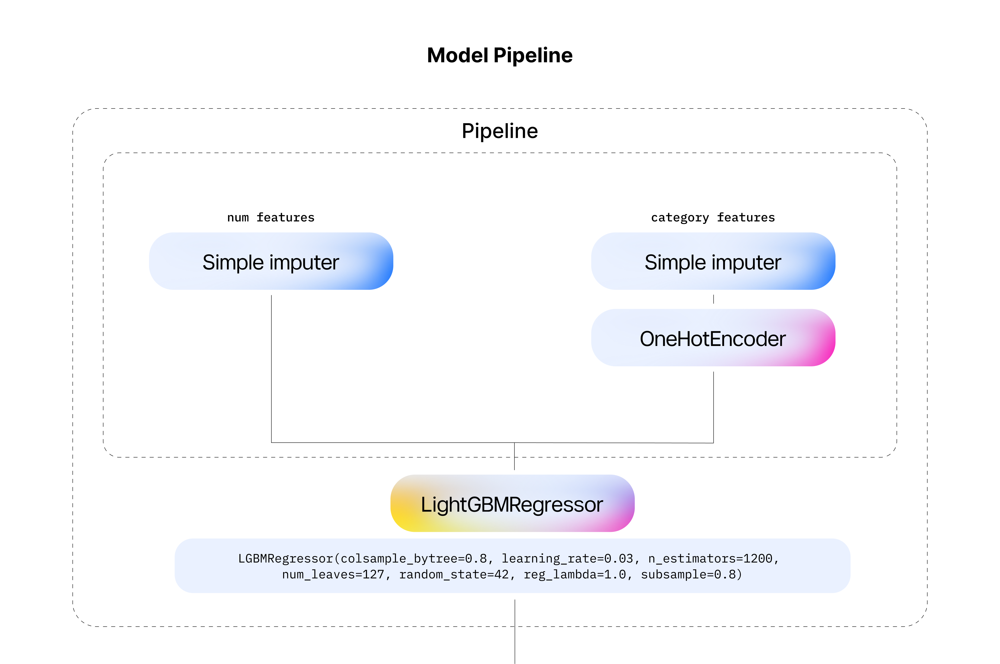
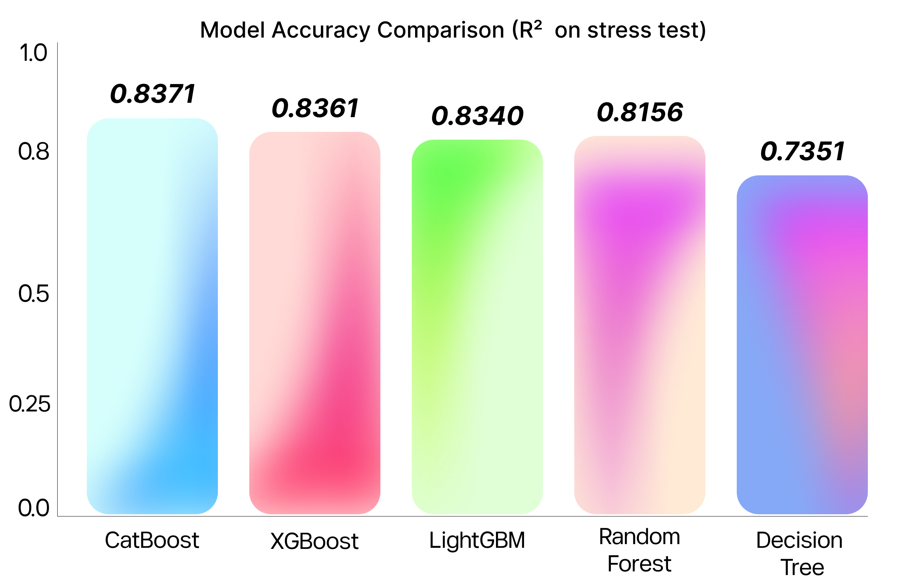
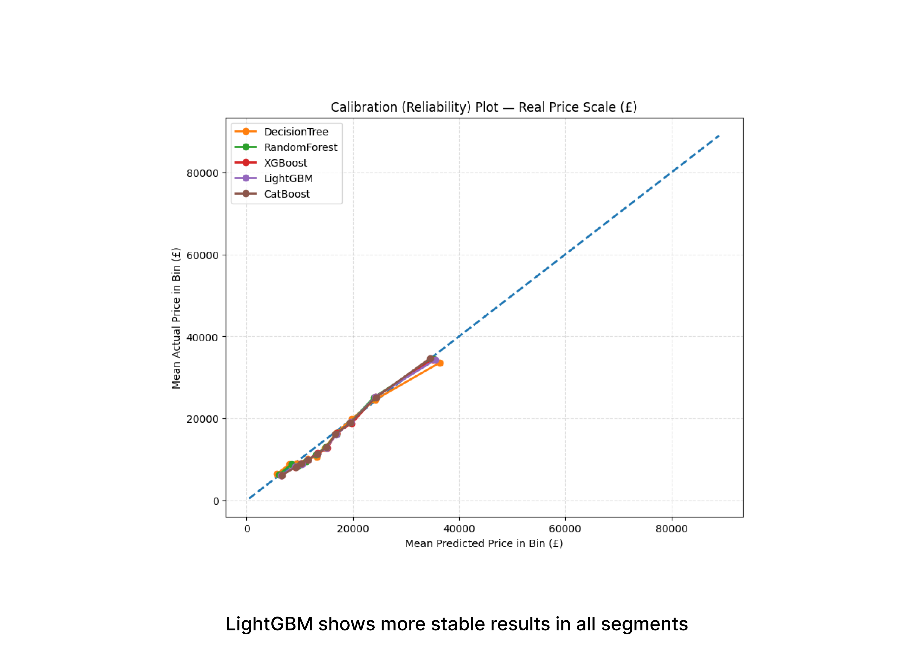

## 🚗 Used Car Price Prediction (UK)


---

## 🛠 Tech Stack

| Category           | Tools         |
| ------------------ | ------------- |
| 🐍 Language        | Python 3.10+  |
| 🤖 ML Model        | LightGBM      |
| 📚 ML Framework    | scikit-learn  |
| 🔍 Explainability  | SHAP          |
| 🌐 App Framework   | Streamlit     |
| 📊 Data Processing | Pandas, NumPy |

---

## 📋 Project Overview

This project develops a **machine learning pipeline to predict used car resale prices in the UK market**.

The system is trained on a dataset of **~100,000 car listings from Kaggle** and benchmarks multiple machine learning models using the same preprocessing and validation pipeline.

After evaluating **five models**, **LightGBM** achieved the best performance:

**📈 R² Score:** `0.9643`

To ensure transparency, the system integrates **SHAP explainability**, allowing users to understand how each feature influences the predicted price.

A **Streamlit prototype application** enables users to:

* 🚘 Input vehicle attributes
* 💰 Receive an estimated resale price
* 📊 View **feature-level explanations** showing how each variable contributed to the prediction

---

## 🎯 Research Contributions

This project addresses three key gaps identified in existing literature:

### 📊 Systematic Multi-Model Benchmarking

All models are evaluated under identical preprocessing, training, and validation pipelines to ensure fair comparison.

### 🔎 Explainability by Design

Explainability is integrated using **SHAP** as a **core component of the model pipeline**, not added as a post-hoc feature.

### 🖥 Interactive ML Prototype

A functional **Streamlit application** allows real-time predictions with interpretable explanations, demonstrating practical deployment of the model.

---

## 🎯 Project Aims & Objectives

### 🎯 Primary Aim

To **build, evaluate, and deploy an accurate and interpretable machine learning model** for predicting **UK used car prices**, demonstrating that **predictive accuracy and explainability can be jointly optimised**.

---

### 📌 Objectives

* 📂 **Data Integration**
  Collect and integrate **~100,000 used car listings** from multiple manufacturer CSV files into a unified dataset.

* 🔎 **Exploratory Data Analysis (EDA)**
  Perform comprehensive EDA to identify **distribution patterns, outliers, and feature relationships**.

* 🧠 **Feature Engineering**
  Engineer domain-relevant variables including:

  * Vehicle age
  * Log-transformed mileage
  * Feature interaction terms
  * Binary market-segment indicators

* 🤖 **Model Training & Validation**
  Train and cross-validate five machine learning models:

  * LightGBM
  * XGBoost
  * CatBoost
  * Random Forest
  * Decision Tree

* 📊 **Model Selection**
  Select the best-performing model using evaluation metrics:

  | Metric | Purpose                  |
  | ------ | ------------------------ |
  | R²     | Variance explained       |
  | RMSE   | Error magnitude          |
  | MAE    | Average prediction error |

  Evaluation is performed on both **log-price and real-price scales**.

* 🔍 **Model Explainability**
  Compute **SHAP values** to generate:

  * Global explanations (**beeswarm plots**)
  * Local explanations (**waterfall plots**)

* 🧪 **Out-of-Distribution Stress Testing**
  Apply **GroupShuffleSplit by `brand_model`** to evaluate generalisation to unseen vehicle types.

* 🌐 **Prototype Deployment**
  Deploy a **Streamlit web application** that returns:

  * Predicted resale price
  * SHAP waterfall explanation of the prediction

---

## ⚙️ Project Pipeline

The workflow follows a **structured six-stage machine learning pipeline**, progressing from raw data ingestion to final model evaluation.


**Figure 1 — End-to-end project pipeline:**
*Raw Data → Target Cleaning → Feature Engineering → Imputation → Scaling/Encoding → Model Testing*

---

---

# 📊 Dataset & Feature Engineering

## 📂 Dataset

| Attribute              | Description                                                      |
| ---------------------- | ---------------------------------------------------------------- |
| 📍 **Source**          | Kaggle — Used Car Dataset (Ford & Mercedes + multi-manufacturer) |
| 📊 **Size**            | ~100,000 observations                                            |
| 🧾 **Raw Variables**   | 10                                                               |
| 🚘 **Brands**          | Audi, BMW, Ford, Mercedes, Toyota, Vauxhall, VW + others         |
| 🎯 **Target Variable** | `price (£)`                                                      |

To stabilise variance and improve model learning, the target variable was **log-transformed**:

```python
log_price = log1p(price)
```

---

## 🧠 Engineered Features

Domain-informed features were created to better capture **vehicle depreciation patterns and usage intensity**.

```python
vehicle_age    = current_year - year
CAE            = log1p(vehicle_age)           # Compressed Age Effect
log_mileage    = log1p(mileage)
km_per_year    = mileage / (vehicle_age + 1)  # Usage intensity
mileage_age_interaction = log_mileage * CAE   # Combined depreciation
high_mileage   = 1 if mileage > 100000
large_engine   = 1 if engineSize >= 2.0
auto_large_eng = 1 if Automatic & engineSize >= 2.0
```

These transformations help capture **nonlinear depreciation effects and interactions between vehicle age, mileage, and engine size**.

---

## 🔗 Feature Correlation Structure

**Figure 2 — Feature correlation heatmap**


---

**Figure 3 — Pearson correlation matrix**


---

# 🔧 Model Pipeline Architecture

The **scikit-learn `Pipeline`** encapsulates all preprocessing within the model to **prevent data leakage during cross-validation**.

Separate preprocessing branches are used for **numerical and categorical features** before feeding into the final model.

**Figure 4 — Model pipeline structure**



This architecture ensures **reproducible preprocessing across training and validation folds**.

---

## ⚙️ LightGBM Hyperparameters

```python
LGBMRegressor(
    n_estimators=1200,
    learning_rate=0.03,
    num_leaves=127,
    subsample=0.8,
    colsample_bytree=0.8,
    reg_lambda=1.0,
    random_state=42
)
```

These parameters were tuned to balance **model complexity, generalisation performance, and training stability**.

---

# 📈 Results

## 5-Fold Cross-Validation Performance

| Model          | R² (Real)  | RMSE (£)   | MAE (£)    | R² (Log)   |
| -------------- | ---------- | ---------- | ---------- | ---------- |
| ✅ **LightGBM** | **0.9643** | **£1,841** | **£1,092** | **0.9690** |
| XGBoost        | 0.9616     | £1,908     | £1,153     | 0.9674     |
| CatBoost       | 0.9607     | £1,930     | £1,167     | 0.9674     |
| Random Forest  | 0.9608     | £1,930     | £1,135     | 0.9632     |
| Decision Tree  | 0.9393     | £2,400     | £1,388     | 0.9404     |

🏆 **LightGBM achieved the best overall performance**, delivering the highest R² and lowest prediction errors across evaluation metrics.

---



---

# 📊 Model Accuracy Comparison (Stress Test)

**Figure 5 — R² performance under out-of-distribution testing using `GroupShuffleSplit` by `brand_model`.**


---

# 📈 Calibration (Reliability) Analysis

**Figure 6 — Calibration plot:**



Key observations:

* All **ensemble models track the ideal 45° line closely up to ~£35,000**, covering the majority of listings.
* **LightGBM shows the most stable calibration** across market segments.
* Above **£35,000**, all models begin to **systematically underestimate prices**.

This behaviour is attributed to **data sparsity in high-value vehicles**, rather than a deficiency of the learning algorithms.

---

# 🔍 Explainability — SHAP Analysis

Model interpretability is provided using **SHAP (SHapley Additive exPlanations)** with the **TreeSHAP algorithm** applied to the trained LightGBM model.

Two complementary explanation types are generated:

| Type                      | Purpose                                                           |
| ------------------------- | ----------------------------------------------------------------- |
| 🌍 **Global Explanation** | Beeswarm plot showing feature influence across the entire dataset |
| 🎯 **Local Explanation**  | Waterfall plot explaining a single prediction                     |

---

## 🧠 Key SHAP Findings

* 🔧 **engineSize** — strongest positive price driver
  Large engines command significant premiums (SHAP values up to **+0.75**).

* ⏳ **CAE (vehicle age)** — dominant negative driver
  Older vehicles strongly cluster toward negative contributions.

* 📉 **mileage_age_interaction**
  Reinforces depreciation effects beyond either variable individually.

* 🚘 **Premium Brands (Audi, BMW, Mercedes)**
  Consistent positive SHAP contributions reflecting **brand premium effects**.

* 💰 **brand_vauxhall**
  Associated with **below-average predicted resale values**.

* ⚙️ **transmission_Manual**
  Displays **bidirectional effects**, depending on vehicle segment.

---

# 🕵️ Deal Detection System (Concept)

Beyond prediction, the system proposes a **deal detection framework** to identify listings that may represent good buying opportunities.

**Figure 7 — Deal Detection System Architecture**


### Algorithm Logic

```python
if actual_price < predicted_price:
    label = "potentially good price"

elif actual_price ≈ predicted_price:
    label = "fair market price"

else:
    label = "overpriced"
```

This concept transforms the model from **pure prediction** into a **decision-support tool for buyers**.

---

# 🚀 Quick Start

## Prerequisites

* Python **3.10+**
* `pip` or `conda`

---

## Installation

```bash
git clone https://github.com/yourusername/used-car-price-prediction.git
cd used-car-price-prediction
pip install -r requirements.txt
```

---

## Run the Streamlit App

```bash
streamlit run app.py
```

---

## Train the Model

```bash
python train.py
```

---

# 📁 Project Structure

```text
used-car-price-prediction/
│
├── data/                  # Raw CSV files from Kaggle
├── notebooks/             # EDA and model development notebooks
│
├── src/
│   ├── data_loader.py     # Multi-file CSV loading + schema alignment
│   ├── feature_eng.py     # fe_transform() — feature engineering
│   ├── train.py           # Training pipeline + K-Fold cross-validation
│   └── evaluate.py        # Calibration, SHAP, stress testing
│
├── app.py                 # Streamlit interactive demo
├── models/                # Serialized trained pipelines (joblib)
└── requirements.txt
```

---

# 📚 Theoretical Background

The modelling framework draws on established economic and machine learning theory.

### Hedonic Pricing

Based on **Rosen (1974)**, vehicle prices are modelled as the sum of implicit values of their attributes.

### Information Asymmetry

Inspired by **Akerlof (1970)**, the system aims to reduce information gaps between buyers and sellers.

### Depreciation Dynamics

Non-linear depreciation patterns identified in **Hulten & Wykoff (1981)** are incorporated through the **Compressed Age Effect (CAE)** feature.

### Explainable AI

Model interpretability is implemented using **SHAP (Lundberg & Lee, 2017)**, which satisfies:

* Local accuracy
* Missingness
* Consistency

TreeSHAP provides **polynomial-time computation**, making it feasible for large datasets.

---

# ✅ Key Findings

* 🏆 **LightGBM achieved the best predictive performance**
  **R²_real = 0.9643**, **MAE_real = £1,092** under 5-fold cross-validation.

* 🧪 **Out-of-distribution stress test:**
  LightGBM achieved **R²_real = 0.8021** using `GroupShuffleSplit` by `brand_model`.

* 🔧 **Engine size** is the most influential continuous predictor.

* ⏳ **Vehicle age (CAE)** consistently acts as the strongest negative price driver.

* 📉 All ensemble models **underestimate prices above £35,000** due to sparse training data.

* 🔗 The **mileage_age_interaction** feature adds predictive power beyond individual variables.

* 🚘 **Premium brand effects** (Audi, BMW, Mercedes) are clearly visible and consistent with residual value literature.

---

