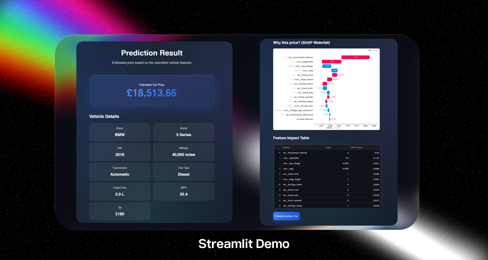

# Car Price Predictor — UK Market

> End-to-end machine learning system for predicting used car prices in the UK market.  
> Combines data preprocessing, feature engineering, model training, and deployment via Streamlit and Docker.

---

## Overview


Predicts used car prices based on:

| Feature | Description |
|---|---|
| Brand & Model | Make and variant |
| Year | Year of manufacture |
| Mileage | Total distance driven |
| Engine Size | Displacement in litres |
| Fuel Type | Petrol / Diesel / Hybrid / Electric |
| Transmission | Manual / Automatic |

**Design goals:** reproducible · explainable (SHAP-ready) · containerised

---

## Model & Performance

| Property | Detail |
|---|---|
| Algorithm | LightGBM Regressor |
| Target | Log-transformed price |
| RMSE | ≈ £1,800 |
| MAE | ≈ £1,100 |
| R² | 0.96 |

**Engineered features include:**
- Car age (log-transformed)
- Mileage per year
- Brand × fuel type interaction terms

---

## Tech Stack

`Python` · `pandas` · `numpy` · `scikit-learn` · `lightgbm` · `shap` · `streamlit` · `Docker`

---

## Quick Start

The only dependency you need locally is **Docker**.

```bash
# Verify Docker is installed
docker --version
```

### 1. Clone the repository

```bash
git clone <your-repo-link>
cd <project-folder>
```

### 2. Build the Docker image

```bash
docker build --no-cache -t car-price-app .
```

### 3. Run the container

```bash
docker run -p 8501:8501 car-price-app
```

### 4. Open the app
```bash
http://localhost:8501
```
